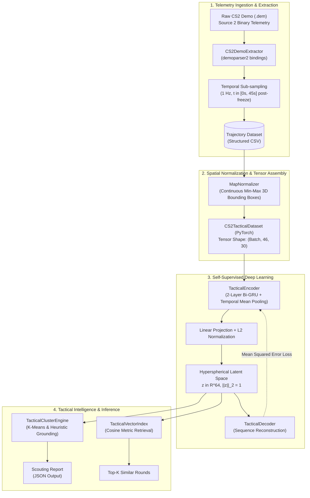

# AntiStrat-AI

### Spatio-Temporal Deep Learning and Tactical Scouting Engine for Counter-Strike 2

[](https://www.python.org/)
[](https://pytorch.org/)
[](https://scikit-learn.org/)
[](https://pandas.pydata.org/)
[](LICENSE)

An automated machine learning pipeline that transforms raw binary game telemetry into dense spatio-temporal representations, unsupervised tactical playbook clusters, and metric-based similarity retrieval for professional esports analytics.

---

## Overview

In competitive esports analytics, tactical match preparation ("anti-stratting") traditionally demands dozens of hours of manual video and demo review by analysts and coaching staff to identify opponent habits, map control defaults, and site execution setups.

**AntiStrat-AI** automates this workflow end-to-end through a modular data and machine learning pipeline:

1. **Telemetry Ingestion**: Ingests high-frequency tick telemetry from raw Source 2 binary demo files (`.dem`) using low-level parser bindings.
2. **Spatio-Temporal Preprocessing**: Aligns game sequences post-freeze time and normalizes continuous 3D coordinates into structured multi-agent tensors.
3. **Self-Supervised Representation Learning**: Trains a Bidirectional Gated Recurrent Unit (Bi-GRU) Autoencoder in PyTorch to compress complex 5v5 team movement sequences into fixed-size 64-dimensional latent vectors.
4. **Hyperspherical Metric Projection**: Regularizes embeddings onto a unit hypersphere ($\mathcal{S}^{63}$) to optimize cosine similarity comparisons.
5. **Unsupervised Playbook Discovery**: Clusters tactical embeddings using $K$-Means and generates structured scouting reports with spatial heuristics.
6. **Similarity-Based Retrieval**: Provides an in-memory vector index to query and retrieve historically analogous rounds in constant retrieval time.

---

## System Architecture



---

## Mathematical and Methodological Formulation

### 1. Multi-Agent Spatio-Temporal Tensor Formulation

For each round $r$ and team $\mathcal{T} \in \{\text{TERRORIST}, \text{CT}\}$, player movements during the opening execution window ($t \in [0, 45]$ seconds post-freeze) are represented as a multi-agent multivariate sequence:

$$\mathbf{X}^{(r)} \in \mathbb{R}^{T \times D}$$

where:
- **Temporal Horizon**: $T = 46$ timesteps, sampled uniformly at 1 Hz from game tick streams.
- **Feature Dimensionality**: $D = N_{\text{players}} \times F_{\text{features}} = 5 \times 6 = 30$ features.
- **Player State Vector**: $\mathbf{f}_{i, t} = [X_{\text{norm}}, Y_{\text{norm}}, Z_{\text{norm}}, \psi_{\text{norm}}, h_{\text{norm}}, a_{\text{alive}}]^T \in [0, 1]^6$
  - Continuous 3D coordinates $(X, Y, Z)$ are normalized per map using official boundary constants:
    $$X_{\text{norm}} = \text{clip}\left(\frac{X - X_{\min}}{X_{\max} - X_{\min}}, 0, 1\right)$$
  - View angle (yaw) is mapped from angular degrees: $\psi_{\text{norm}} = \frac{\psi + 180^\circ}{360^\circ} \in [0, 1]$
  - Health and alive state: $h_{\text{norm}} = \frac{\text{health}}{100} \in [0, 1]$ and $a_{\text{alive}} \in \{0, 1\}$.

### 2. Bidirectional Recurrent Representation Learning

To compress the temporal dynamics into a fixed-length embedding without handcrafted feature engineering, a sequence-to-sequence architecture is employed:

- **Bidirectional Temporal Encoding**:
  $$\vec{h}_t = \text{GRU}_{\text{fwd}}(\mathbf{x}_t, \vec{h}_{t-1}), \quad \overleftarrow{h}_t = \text{GRU}_{\text{bwd}}(\mathbf{x}_t, \overleftarrow{h}_{t+1})$$
  $$H_t = [\vec{h}_t \,\|\, \overleftarrow{h}_t] \in \mathbb{R}^{2 \cdot H_{\text{dim}}} \quad (H_{\text{dim}} = 128 \implies 256)$$

- **Temporal Pooling & Linear Projection**:
  $$\bar{H} = \frac{1}{T} \sum_{t=1}^{T} H_t, \quad \tilde{\mathbf{z}} = \mathbf{W}_p \bar{H} + \mathbf{b}_p \in \mathbb{R}^{64}$$

- **Hyperspherical $L_2$ Normalization**:
  The latent representation is projected onto the unit hypersphere $\mathcal{S}^{63}$:
  $$\mathbf{z} = \frac{\tilde{\mathbf{z}}}{\|\tilde{\mathbf{z}}\|_2}$$
  
  *Geometric Property*: Because $\|\mathbf{z}\|_2 = 1$, the Euclidean distance directly monotonically maps to Cosine distance:
  $$\|\mathbf{z}_i - \mathbf{z}_j\|_2^2 = 2 - 2 \cos(\mathbf{z}_i, \mathbf{z}_j)$$

- **Decoding & Reconstruction Loss**:
  The decoder reconstructs the original normalized trajectory $\hat{\mathbf{X}} = \sigma(\text{Dec}(\mathbf{z}))$. The network is trained with the Mean Squared Error (MSE) objective:
  $$\mathcal{L}_{\text{MSE}} = \frac{1}{B \cdot T \cdot D} \sum_{b=1}^{B} \sum_{t=1}^{T} \sum_{d=1}^{D} \left( X_{b, t, d} - \hat{X}_{b, t, d} \right)^2$$

### 3. Metric Similarity and Unsupervised Clustering

- **Pairwise Tactical Similarity**:
  Given two round embeddings $\mathbf{z}_a, \mathbf{z}_b \in \mathcal{S}^{63}$, the similarity score is defined as:
  $$\text{Sim}(\mathbf{z}_a, \mathbf{z}_b) = \mathbf{z}_a^T \mathbf{z}_b \in [-1, 1]$$
- **Unsupervised Playbook Partitioning**:
  $K$-Means clustering minimizes within-cluster inertia in the embedding space:
  $$\arg\min_{\mathcal{S}} \sum_{k=1}^{K} \sum_{\mathbf{z} \in S_k} \|\mathbf{z} - \boldsymbol{\mu}_k\|_2^2$$
  This clusters rounds into macroscopic tactical plays (e.g., A Split, Mid-to-B, Long control) without manual supervision.

---

## Repository Structure

```text
AntiStrat-AI/
├── data/
│   ├── raw_demos/             # Tournament CS2 demo files (.dem)
│   ├── processed/             # Cleaned trajectory datasets (CSV)
│   └── embeddings/            # PyTorch model checkpoints and reports
├── models/                    # Serialized production model weights
├── src/
│   ├── parser/
│   │   ├── demo_extractor.py  # Binary demo parsing and CSV extraction
│   │   └── map_normalizer.py  # Coordinate normalizer for competitive maps
│   ├── models/
│   │   ├── dataset.py         # PyTorch Dataset and DataLoader implementations
│   │   ├── tactical_encoder.py# Bi-GRU Autoencoder architecture
│   │   └── trainer.py         # Training loop, optimization, and inference
│   └── clustering/
│       ├── cluster_engine.py  # K-Means clustering and scouting report generator
│       └── vector_index.py    # Cosine similarity vector search index
├── airflow/                   # DAG templates for scheduled batch workflows
├── run_pipeline.py            # Master end-to-end execution script
├── requirements.txt           # Project environment dependencies
└── README.md                  # System documentation
```

---

## Installation & Getting Started

### 1. Prerequisites and Environment Setup

- Python 3.10 or higher
- A standard virtual environment manager (`venv` or `conda`)

```bash
git clone https://github.com/delaubier/AntiStrat-AI.git
cd AntiStrat-AI

python -m venv .venv
source .venv/bin/activate  # On Windows: .venv\Scripts\activate

pip install -r requirements.txt
```

### 2. Running the Full Pipeline

To execute the end-to-end pipeline (demo parsing, dataset generation, model training, embedding extraction, clustering, and vector search):

```bash
python run_pipeline.py
```

### 3. Modular API Usage

Each pipeline component can be imported and executed independently:

```python
import pandas as pd
from src.parser.demo_extractor import CS2DemoExtractor
from src.models.dataset import CS2TacticalDataset
from src.models.trainer import TacticalTrainer
from src.clustering.vector_index import TacticalVectorIndex

# 1. Parse demo telemetry into tabular format
extractor = CS2DemoExtractor("data/raw_demos/match.dem")
csv_path = extractor.process_and_save()

# 2. Build PyTorch Dataset (46 timesteps x 30 features)
dataset = CS2TacticalDataset(csv_path, team_side="TERRORIST")

# 3. Extract 64-dimensional tactical embeddings
trainer = TacticalTrainer()
embeddings_df = trainer.extract_embeddings(dataset)

# 4. Search for the Top-3 tactically similar rounds to Round 5
index = TacticalVectorIndex(embeddings_df)
results = index.search_similar(query_round_index=5, top_k=3)

for rank, match in enumerate(results, 1):
    print(f"Rank {rank}: Round {match['round_index']} (Similarity: {match['similarity_score']}%)")
```

---

## Sample Output & Evaluation

### Automated Tactical Scouting Report (`de_dust2` - Terrorist Side)

```json
{
  "total_rounds_analyzed": 21,
  "team_side": "TERRORIST",
  "map_name": "de_dust2",
  "clusters": [
    {
      "cluster_id": 0,
      "tactical_label": "Site B Upper Tunnels / Fast Rush",
      "rounds_count": 1,
      "frequency_percentage": 4.8,
      "rounds_list": [5]
    },
    {
      "cluster_id": 1,
      "tactical_label": "Long A Control & Cross Execute",
      "rounds_count": 8,
      "frequency_percentage": 38.1,
      "rounds_list": [3, 7, 10, 11, 12, 13, 15, 17]
    },
    {
      "cluster_id": 2,
      "tactical_label": "Middle & Catwalk Control / Split A",
      "rounds_count": 12,
      "frequency_percentage": 57.1,
      "rounds_list": [1, 2, 4, 6, 8, 9, 14, 16, 18, 19, 20, 21]
    }
  ]
}
```

### Vector Similarity Search Query

```text
Query: Reference Round #3
Results:
  1. Round 10 (Tactical Similarity: 94.82%)
  2. Round 7  (Tactical Similarity: 91.15%)
  3. Round 17 (Tactical Similarity: 89.60%)
```

---

## Technical Stack & Design Decisions

| Layer | Technology | Architectural Rationale |
| :--- | :--- | :--- |
| **Telemetry Parsing** | `demoparser2` | Low-level C++/Rust bindings for fast parsing of Source 2 binary tick streams |
| **Data Processing** | `pandas`, `numpy`, `CSV` | Structured tabular representations with complete inspection and reproducibility |
| **Deep Learning** | `PyTorch` | Dynamic computational graph and native sequence modeling via Bi-GRU |
| **Metric Learning** | Hyperspherical $L_2$ Projection | Eliminates norm discrepancies and unifies Euclidean and Cosine distances |
| **Unsupervised ML** | `scikit-learn` ($K$-Means) | Unsupervised pattern discovery without reliance on manual game labels |
| **Pipeline Workflow** | Modular OOP Architecture | Clean separation of concerns with DAG orchestration templates for Airflow |

---

## Academic & Portfolio Context

- **Author**: Thomas Delaubier
- **Program**: Master 2 Applied Mathematics and Statistics – Data Science and Artificial Intelligence
- **Core Competencies Demonstrated**:
  - **Spatio-Temporal Modeling**: Multi-agent trajectory structuring, temporal resampling, continuous 3D coordinate normalization.
  - **Deep Representation Learning**: Sequence-to-sequence modeling with Bidirectional GRUs, latent bottleneck design, self-supervised reconstruction.
  - **Metric Learning & Geometry**: Hyperspherical constraints, distance metric equivalence, cosine retrieval indexing.
  - **Software Engineering**: Clean modular object-oriented architecture, type hint annotations, reproducibility, and production-oriented design.

---

## License

This project is distributed under the MIT License. See the [LICENSE](LICENSE) file for more information.