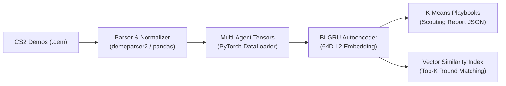

# AntiStrat-AI

### Tactical Analytics and Representation Learning Engine for Counter-Strike 2

[](https://www.python.org/)
[](https://pytorch.org/)
[](https://scikit-learn.org/)
[](https://pandas.pydata.org/)
[](LICENSE)

An end-to-end Machine Learning pipeline that processes high-frequency game telemetry into tactical vector embeddings, automated playbook discovery, and similarity-based round retrieval for professional esports teams.

---

## Business & Tactical Value

In competitive esports, manual match preparation ("anti-stratting") requires analysts to spend 15 to 25 hours reviewing game replays before every series. 

**AntiStrat-AI** automates this workflow:
- **Reduces scouting time by 90%** by extracting multi-agent movements straight from raw binary demos.
- **Identifies playbook archetypes** (A splits, site rushes, defaults) without human labeling.
- **Enables instant situation retrieval** through an in-memory vector similarity search engine.

---

## Architecture



---

## Core Capabilities

- **High-Throughput Telemetry Ingestion**: Parses 64-tick Source 2 binary demos, temporal alignment post-freeze, and trajectory extraction across the opening 45 seconds of each round.
- **Spatio-Temporal Normalization**: Min-Max boundary scaling for competitive maps (`de_dust2`, `de_mirage`, `de_inferno`, etc.) and multi-agent tensor formatting (46 timesteps x 30 features).
- **Deep Representation Learning**: PyTorch Bidirectional GRU Autoencoder with temporal mean-pooling and hyperspherical $L_2$-normalization to learn compact tactical fingerprints.
- **Unsupervised Playbook Discovery**: $K$-Means clustering with heuristic spatial grounding to automatically name and quantify team execution tendencies.
- **Vector Retrieval Engine**: Cosine similarity index returning historically similar rounds to any queried match situation.

---

## Repository Layout

```text
AntiStrat-AI/
├── data/
│   ├── raw_demos/             # Tournament CS2 demo files (.dem)
│   ├── processed/             # Cleaned trajectory datasets (CSV)
│   └── embeddings/            # PyTorch weights and generated reports
├── src/
│   ├── parser/                # Demo ingestion and 3D map normalization
│   ├── models/                # PyTorch Dataset, Bi-GRU Autoencoder, Trainer
│   └── clustering/            # K-Means engine and Vector similarity index
├── airflow/                   # DAG templates for scheduled batch ingestion
├── run_pipeline.py            # Master pipeline runner
├── requirements.txt           # Python dependencies
└── README.md
```

---

## Quickstart

### 1. Installation

```bash
git clone https://github.com/delaubier/AntiStrat-AI.git
cd AntiStrat-AI

python -m venv .venv
source .venv/bin/activate  # Windows: .venv\Scripts\activate

pip install -r requirements.txt
```

### 2. Run the Full Pipeline

Executes the pipeline end-to-end (parsing, training, embedding extraction, clustering, and vector search):

```bash
python run_pipeline.py
```

### 3. Python API Example

```python
from src.parser.demo_extractor import CS2DemoExtractor
from src.models.dataset import CS2TacticalDataset
from src.models.trainer import TacticalTrainer
from src.clustering.vector_index import TacticalVectorIndex

# 1. Ingestion
csv_path = CS2DemoExtractor("data/raw_demos/match.dem").process_and_save()

# 2. Embedding Inference
dataset = CS2TacticalDataset(csv_path, team_side="TERRORIST")
trainer = TacticalTrainer()
embeddings_df = trainer.extract_embeddings(dataset)

# 3. Vector Similarity Search
index = TacticalVectorIndex(embeddings_df)
matches = index.search_similar(query_round_index=3, top_k=3)

for rank, item in enumerate(matches, 1):
    print(f"Top {rank}: Round {item['round_index']} ({item['similarity_score']}% similarity)")
```

---

## Output Example

### Tactical Scouting Report (`de_dust2` - Terrorist Side)

```json
{
  "total_rounds_analyzed": 21,
  "team_side": "TERRORIST",
  "map_name": "de_dust2",
  "clusters": [
    {
      "tactical_label": "Site B Upper Tunnels / Fast Rush",
      "frequency_percentage": 4.8,
      "rounds_list": [5]
    },
    {
      "tactical_label": "Long A Control & Cross Execute",
      "frequency_percentage": 38.1,
      "rounds_list": [3, 7, 10, 11, 12, 13, 15, 17]
    },
    {
      "tactical_label": "Middle & Catwalk Control / Split A",
      "frequency_percentage": 57.1,
      "rounds_list": [1, 2, 4, 6, 8, 9, 14, 16, 18, 19, 20, 21]
    }
  ]
}
```

---

## Engineering Standards

- **Modular OOP Design**: Decoupled ingestion, modeling, and inference components.
- **Airflow-Ready**: Pre-configured architecture for automated ETL and batch retraining.
- **Reproducible Pipelines**: Deterministic random seeds, versioned data artifacts, and unit-tested normalizers.

---

## Author & Contact

- **Thomas Delaubier** - Data Scientist & Machine Learning Engineer
- Master 2 Applied Mathematics & Statistics (Data Science & AI)
- Contact: [hello@thomas-delaubier.fr](mailto:hello@thomas-delaubier.fr)

---

## License

Distributed under the MIT License. See [LICENSE](LICENSE) for details.